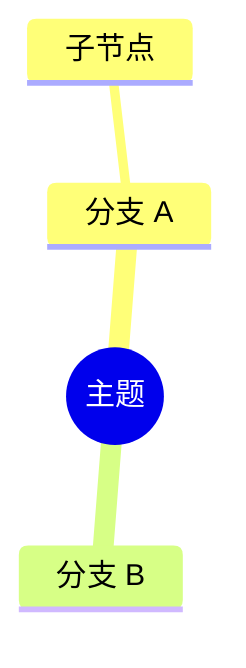

# 导图生成 Skill

当用户需要思维导图、大纲、知识结构时使用本 Skill。

## 输出格式

优先输出 **Mermaid mindmap** 代码块：

若内容较复杂，可在代码块前附 **层级大纲**（Markdown 标题 + 列表）。

## 规则

- 根节点用文档/选区的核心主题
- 层级 2–4 层为宜，避免过深
- 节点文字简短（≤ 15 字），可合并同类项
- 保持与原文逻辑一致，不添加原文没有的分支
- 代码块必须可被 Mermaid 解析；语法错误时修正后再输出
